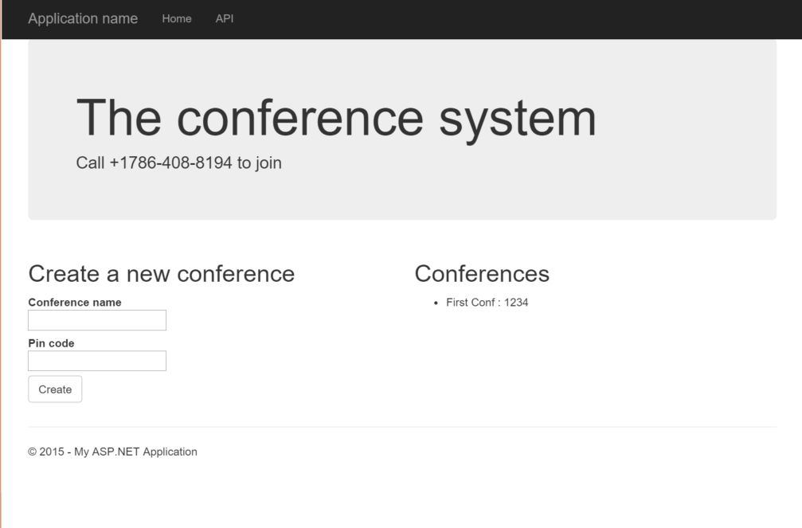
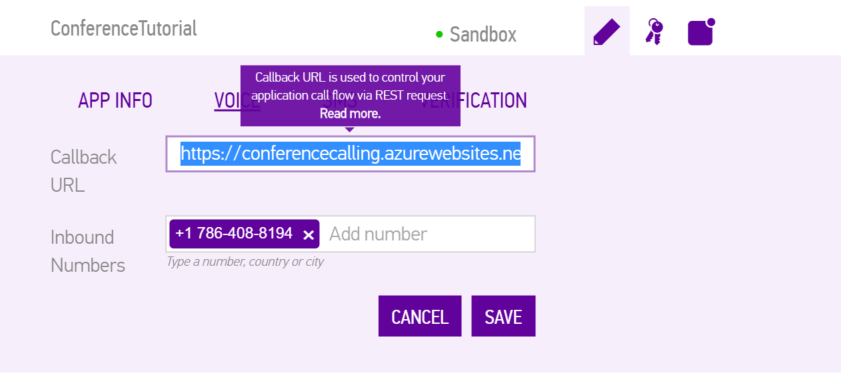
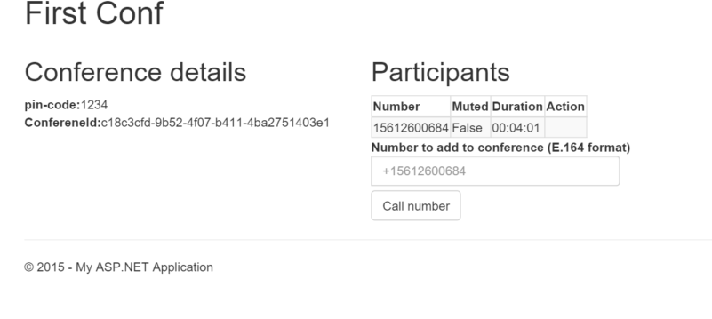

<h1>Build your own Conference Calling in C#</h1>


Tight budgets, busy schedules, better technology and the urge for immediacy has made virtual interaction a common communications and collaborations strategy for businesses today. Accordingly, [virtual teams are naturally increasing] (https://www.sinch.com/opinion/must-have-saas-tools-for-every-virtual-team/).

On top of this, [psychological impacts of voice can be very useful in business] (https://www.sinch.com/learn/psychological-impacts-voice-business/), as voice is our most powerful tool for communication.

However, as we've pointed out before; being the middleman of whichever project, and having to go through the “I just need to call X, Y and Z, and then I’ll call you back”-procedure is super annoying and time consuming.

Create a system that connects a bunch of people in a conference call instead!

**In this tutorial, we'll show how easy it is to build a regular conference calling solution with both Dial in and Dial out functionality. In part 2 and 3, we'll add VoIP clients to the mix.**


## Prerequisites 
1. [Sinch account and a Voice enabled number] (https://www.sinch.com/dashboard#/numbers)
2. Some cash on your account
3. A MVC project with Web API enabled project


## The Data model
For this conferencing system, we're going to use the Code first EF as our persistence layer. We'll want to be able to give out phone numbers together with pin codes to the people joining. To keep track of various conferences, we'll give each of them a name.

Also, set the max length to 4 (we're responding to 4 digit codes in this example). For a production app, you'd need to ensure that the pin code's also unique, but we wont worry about that here.

It's a pretty straight forward data model - create a file, call it **ConferenceModels.cs**, and add below:

```csharp
public class Conference {
	public int Id { get; set; }
    public string ConferenceName { get; set; }
	[MaxLength(4)]
    public string PinCode { get; set; }
    public Guid ConferenceId { get; set; }
}
```
To store this information later and use it in our callbacks, we need a data context with a default connection (for more info on EF code first, check out [this tutorial] (https://www.asp.net/mvc/overview/getting-started/getting-started-with-ef-using-mvc/creating-an-entity-framework-data-model-for-an-asp-net-mvc-application).

```csharp
public class ConferenceContext : DbContext {
        public DbSet<Conference> Conferences { get; set; }
        public ConferenceContext() : base("DefaultConnection") {
        }
    }
```
Don't forget to add a connection string:

```xml
  <connectionStrings>
    <add name="DefaultConnection" connectionString="Data Source=server,1433;Initial Catalog=conferencecalling;User Id=username;Password=pwd" providerName="System.Data.SqlClient" />
  </connectionStrings>
```

Now, in Package Manager Console, run:

```
pm>Enable-Migrations
```   
Open **Migrations\Configuration.cs** and set `AutomaticMigrationsEnabled = true;`
in pm. Run:
```
pm>Update-Database
```

## Creating a conference
With this out of the way we can save conferences, open **HomeController.cs** and add an action called Create. No calling's going on at the moment, so we are just saving this for future usage. 
 
```
public async Task<RedirectToRouteResult> Create(Conference model) {
	using (var db = new ConferenceContext()) {
        // lets add a new guid to the model to ensure that all conferences are uniq
		model.ConferenceId = Guid.NewGuid();
        //save it
        db.Conferences.Add(model);
    	await db.SaveChangesAsync();
    }
    //return to home controller
	return RedirectToAction("Index");
}
```

Done. Next thing is to give our system's Index action all current conferences. So, change Index action to look like this:

```
public ActionResult Index() {
    using (var db = new ConferenceContext())
    {
        var model = db.Conferences.ToList();
        return View(model);
    }
}
```

## UI
We want our home view to show a list of current conferences and the ability to start a new conference. So get rid of all the code and add the following in **Views/Home/Index.cshtml**:

```html
@model List<ConferenceCalling.Models.Conference>
<div class="jumbotron">
    <h1>The conference system</h1>
	<p>Call +1786-408-8194 to join</p>
</div>
<div class="row">
    <div class="col-md-6">
        <h2>Create a new conference</h2>
        <p>
			@using (Html.BeginForm("Create", "Home", FormMethod.Post)) {
                <label>
                    Conference name<br />
                    <input type="text" name="ConferenceName" />
                </label><br />
                <label>
                    Pin code<br />
                    <input type="number" name="PinCode" />
                </label><br />
                <input class="btn btn-default" type="submit" value="Create" />
            }
        </p>

    </div>
    <div class="col-md-6">
        <h2>Conferences</h2>
        <ul>
            @foreach (var conference in Model) {
                <li>@conference.ConferenceName : @conference.PinCode</li>
            }
        </ul>
    </div>ld a list here later *@
    </div>
</div>
```
Now run it, create a conference, and your page should look like this:


That's it for admin page. Next step is to add the callbacks to enable people to connect to the conference. 

## Callback controller
Create a new API controller and call it **CallbackController**. Then, install our brand new ServerSDK NuGet in PM:

```nugetgithub
pm> Install-Package Sinch.ServerSdk 
```
To read more about this awesome package, [go here](https://github.com/sinch/nuget-serversdk).

Next is to implement the callback. What we're going to build here is a small IVR system where the user enters the code and gets connected to the right conference. That means that we first need to play a menu on Incoming Call Event (ICE), and then react to when a user enters a code.

```csharp
  [HttpPost]
public async Task<SvamletModel> Post(CallbackEventModel model) {
    var sinch = SinchFactory.CreateCallbackResponseFactory(Locale.EnUs);
    var reader = sinch.CreateEventReader();
    var evt = reader.ReadModel(model);
    var builder = sinch.CreateIceSvamletBuilder();
    switch (evt.Event) {
		// 1: Incoming call
        case Event.IncomingCall:
            builder.AddNumberInputMenu("menu1", "Enter 4 digits", 4, "Enter 4 digits", 3, TimeSpan.FromSeconds(60));
            builder.RunMenu("menu1");
            break;
		// 2: menu input
        case Event.PromptInput:
            using (var db = new ConferenceContext()) {

                var conference = db.Conferences.FirstOrDefault(c => c.PinCode == model.MenuResult.Value);
                if (conference != null)
                {
                    builder.ConnectConference(conference.ConferenceId.ToString());
                } else {
                    builder.Say("Invalid code").Hangup(HangupCause.Normal);
                }
            }

            break;
        case Event.AnsweredCall:
            builder.Continue();
            break;
        default:
            break;
    }
    return builder.Build().Model;
}
```
First, you look at what type of event is coming in. Based on that, you 1) Play a menu and wait for input, and 2) Get that input, look it up in the database, and connect to the conference. 

## Configure your app
Go to your dashboard and assign your rented number. Configure the Voice URL for the app you created.



Deploy and take it for test spin!

## Manage Conference Participants
Another cool feature we have is to list the participants in a conference, manage their mic and even kick them out.

Let's start by listing everyone in a conference: In home controller add an action called details.

```csharp
public async Task<ActionResult> Details(int id) {
    var model = new ConferenceDetailsViewModel();
    //1. First fetch the conference details form the database.
    using (var db = new ConferenceContext())
    {
        var conference = db.Conferences.FirstOrDefault(c => c.Id == id);
        if (conference != null)
            model.Conference = conference;
    }
    // Get participants from Sinch
    // 1. Create an api factory
    var sinch = SinchFactory.CreateApiFactory(yourkey, secret);
    // 2. Get a ConferenceApi client
    var conferenceClient = sinch.CreateConferenceApi();
    //fetch the conference 
	try
	{
    var r = await conferenceClient.Conference(model.Conference.ConferenceId.ToString()).Get();
    // store the participants in the result model
    model.Participants = r.Participants;
	}
	catch (Exepction)
	{
		//do nothing, just means no one is in the conference
 		model.Participants = new IParticipant[0];
	}
    return View(model);
}
```

### Add UI
Add a view with the following elements (don't worry about the form, we'll get to that):

```html
@model ConferenceCalling.Models.ConferenceDetailsViewModel
<h1>@Model.Conference.ConferenceName</h1>
<div class="row">
    <div class="col-md-4">
        <h2>Conference details</h2>
        <b>pin-code:</b>@Model.Conference.PinCode<br />
        <b>ConfereneId:</b>@Model.Conference.ConferenceId<br />
    </div>
    <div class="col-md-8">
        <h2>Participants</h2>
        <table class="table-responsive table-bordered table-striped">
            <thead>
                <tr>
                    <th>Number</th>
                    <th>Muted</th>
                    <th>Duration </th>
                    <th>Action</th>
                </tr>
            </thead>
            @foreach (var participant in @Model.Participants) {
                <tr>
                    <td>
                        @participant.Cli
                    </td>
                    <td>@participant.Muted</td>
                    <td>@TimeSpan.FromSeconds(participant.Duration)</td>
                    <td>@* Todo *@</td>
                </tr>
            }
        </table>
        @using (Html.BeginForm("Callout", "Home", FormMethod.Post)) {
            <div class="input-group">
                <label>
                    Number to add to conference (E.164 format)<br />
                    <input type="tel" class="form-control" name="phonenumber" placeholder="+15612600684" />
                </label>
            </div>
            <div class="input-group">
                <input class="btn btn-default" type="submit" value="Call number" />
            </div>
        }
    </div>
</div>
```

Let's take a look at what we added to the table (what a table!).

First, we added the CLI which is the number someone's calling from. Second, we displayed the duration the caller's duration in the conference. Third, we created a caller muted/not muted display.

After a test spin of the functionality, we'll add the methods to mute and kick out participants. 
 
Last enable the list in the Home/Index.cshtml to to be clickable. Change the list in **home/index.cshtml** to:

```html
<div class="col-md-6">
    <h2>Conferences</h2>
    <ul>
        @foreach (var conference in Model) {
            <li>@Html.ActionLink(conference.ConferenceName, "Details", new {id=conference.Id}): @conference.PinCode </li>
        }
    </ul>
</div>
```

Deploy, make a call to the number, and enter your pin. Hit the details and you should see something like this:




## Mute and Kick participants
Go back to your **Home/Details.cshtml** view and add a couple of action links in the list of participants - one for muting/unmuting, and one for kicking out a participant.

```html
 @foreach (var participant in @Model.Participants) {
    <tr>
        <td>
            @participant.Cli
        </td>
        <td>@participant.Muted</td>
        <td>@TimeSpan.FromSeconds(participant.Duration)</td>
        <td>
			@*New code *@
           @{
			string muteAction = (participant.Muted ? "Unmute" : "Mute");
			}
            @Html.ActionLink(muteAction, muteAction, new {id = Model.Conference.Id, conferenceId = @Model.Conference.ConferenceId, participant = participant.Id}) |
            @Html.ActionLink("Kick", "Kick", new {id = Model.Conference.Id, conferenceId = @Model.Conference.ConferenceId, participant = participant.Id})
        </td>
    </tr>
}
```

What we did here was just checking whether a participant was muted or not, plus deciding if we wanted a mute/unmute action to be added. In your home controller, add the actions Mute, Unmute and Kick.

I know it's a tutorial, but let's refactor a little bit as well.

So in **HomeController.cs**, create private methods for getting a confernce and a participant.

```csharp
private IConference Getconference(string conferenceId) {
    // 1. Create an api factory    
	var sinch = SinchFactory.CreateApiFactory(yourkey, secret);
    // 2. Get a ConferenceApi client
    var conferenceClient = sinch.CreateConferenceApi();
    //fetch the conference and return
    return conferenceClient.Conference(conferenceId);
}

private IConferenceParticipant GetParticipant(string conferenceid, string participant) {
    // Get participant
    return Getconference(conferenceid).Participant(participant);
}
```

In your mute/unmute action, add the following:

```csharp
public async Task<ActionResult> UnMute(int id, Guid conferenceid, string participant) {
    await GetParticipant(conferenceid.ToString(), participant).Unmute();
    return RedirectToAction("Details", new { id = id });
}
public async Task<ActionResult> Mute(int id, Guid conferenceid, string participant) {
    await GetParticipant(conferenceid.ToString(), participant).Mute();
    return RedirectToAction("Details", new {id = id});
}
```
Now, let's add the kick out functionality while we are at it.

```csharp
public async Task<RedirectToRouteResult> Kick(int id, Guid conferenceid, string participant) {
    await GetParticipant(conferenceid.ToString(), participant).Kick();
    return RedirectToAction("Details", new { id = id });
}
```
Phew, that's a lot... If you managed to follow everything, the complete home controller should now look like this:

```chsharp
using System;
using System.Linq;
using System.Threading.Tasks;
using System.Web.Mvc;
using ConferenceCalling.Models;
using Sinch.ServerSdk;
using Sinch.ServerSdk.Calling;

namespace ConferenceCalling.Controllers {
    public class HomeController : Controller {
        public ActionResult Index() {
            using (var db = new ConferenceContext())
            {
                var model = db.Conferences.ToList();
                return View(model);
            }
        }

        public async Task<RedirectToRouteResult> Create(Conference model) {
            using (var db = new ConferenceContext()) {
                // lets add a new guid to the model to ensure that all conferences are uniq
                model.ConferenceId = Guid.NewGuid();
                //save it
                db.Conferences.Add(model);
                await db.SaveChangesAsync();
            }
            //return tohome controller
            return RedirectToAction("Index");
        }

        public async Task<ActionResult> Details(int id) {
            var model = new ConferenceDetailsViewModel();
            //1. First fetch the conference details form the database.
            using (var db = new ConferenceContext())
            {
                var conference = db.Conferences.FirstOrDefault(c => c.Id == id);
                if (conference != null)
                    model.Conference = conference;
            }

            try
            {
                var conf = await Getconference(model.Conference.ConferenceId.ToString()).Get();
                // store the participants in the result model
                model.Participants = conf.Participants;
            }
            catch (Exception)
            {
                model.Participants = new IParticipant[0];
                //do nothing, just means no one is in the conference
            }
         
            
            return View(model);
        }

        private IConference Getconference(string conferenceId) {
			// 1. Create an api factory
            var sinch = SinchFactory.CreateApiFactory(yourkey, yousecret);
            // 2. Get a ConferenceApi client
            var conferenceClient = sinch.CreateConferenceApi();
            //fetch the conference 
            return conferenceClient.Conference(conferenceId);
        }

        private IConferenceParticipant GetParticipant(string conferenceid, string participant) {
            // Get participants from Sinch
            return Getconference(conferenceid).Participant(participant);
        }

        public async Task<ActionResult> UnMute(int id, Guid conferenceid, string participant) {
            await GetParticipant(conferenceid.ToString(), participant).Unmute();
            return RedirectToAction("Details", new { id = id });
        }
        public async Task<ActionResult> Mute(int id, Guid conferenceid, string participant) {
            await GetParticipant(conferenceid.ToString(), participant).Mute();
            return RedirectToAction("Details", new {id = id});
        }

        public async Task<RedirectToRouteResult> Kick(int id, Guid conferenceid, string participant) {
            await GetParticipant(conferenceid.ToString(), participant).Kick();

            return RedirectToAction("Details", new { id = id });
        }
  
    }
}

```
Deploy, make a call to the number, and enter your pin. Hit the details and you should see something like this:


## Add someone to a Conference
In this system, we also want the possibility to invite people into the conference by adding their numbers and calling them up.

Let's start with adding a view to show the details for a conference. In the **HomeController.cs**, add an Action called details, and start with just listing basic info plus the participants who's joining the conference.

We need to create a ViewModel than can hold this info in **ConferenceModels.cs**.
 
```csharp
public class ConferenceDetailsViewModel {
    public Conference Conference { get; set; }
    public IParticipant[] Participants { get; set; }
}
```

```csharp
public ActionResult Details(int id) {
    using (var db = new ConferenceContext())
    {
        var conference = db.Conferences.FirstOrDefault(c => c.Id == id);
        if (conference != null)
            return View(conference);
    }
    return RedirectToAction("Index");
}
```

Now, we need to add the code for the Form action to actually call out. This introduces a new type of client called **ApiFactory**: it makes it super simple to make request to our API and takes care of all the signing, URL, etc. for you. Open home controller and add an action and name it Callout.

**Gather your people, go virtual and never ever waste time on the “I just need to call X, Y and Z, and then I’ll call you back”-procedure again.**